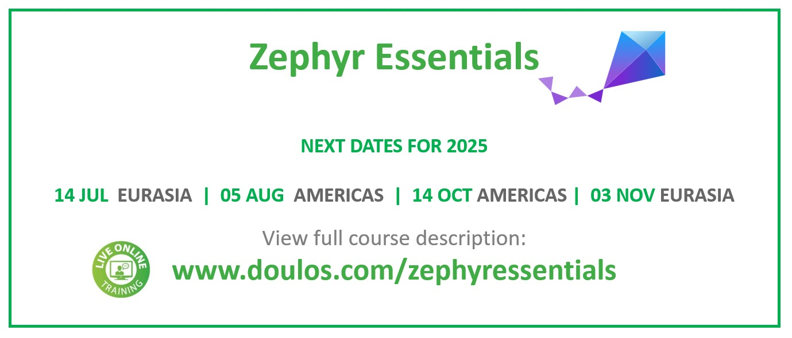

# Zephyr Insights: Scheduling and Threads

Webinar presented by **Loïc Domaigné**  
Senior Members Technical Staff, Doulos

Scheduled on: 18th June 2025.

## Introduction
Github companion for the Doulos Webinar [Zephyr Insights: Scheduling and Threads](https://www.doulos.com/events/webinars/zephyr-insights-scheduling-and-threads/).

## 📚 Training

Looking to find out if Zephyr could be a great fit for your next product? Or looking
to upskill your teams with Zephyr? Check-out our  [Doulos Zephyr Essentials](https://www.doulos.com/training/arm-and-embedded-software/rtos/zephyr-essentials/) 

 

This training will help you maximise the potential of Zephyr for developing embedded products and **get project ready in record time** 😄  We offer both public and team-based events, live online or in-persons. 

💬 [Contact a Doulos Representative](https://forms.doulos.com/enquiry?url=%2ftraining%2farm-and-embedded-software%2frtos%2fzephyr-essentials%2f&title=Zephyr%20Essentials)

### Doulos KnowHow Resources:

- [Zephyr. Yet Another Real-Time OS?](https://www.doulos.com/knowhow/arm-embedded/zephyr-yet-another-real-time-os/)
- [Zephyr, more bang for your buck?](https://www.youtube.com/watch?v=ng8gkCYbjZA)

## Webinar Partners Information:

Thanks to Percepio and IAR for promoting this webinar. 

- [Percepio](https://percepio.com/). To learn more about traceviewers and observability solutions from Percepio:
  - [Information on traceviewers](https://traceviewer.io/)
  - [Building Reliable Embedded Systems with Observability](https://percepio.com/continuous-observability/)

- [IAR](https://www.iar.com/). If you are interested to use the IAR toolchain for Zephyr: 
  - request the [trial](https://www.iar.com/try-platform)
  - or [contact IAR](iar.com/contact)

## Presentation Resources

### Links from the slides

- Slide 3: About Zephyr  
  https://github.com/zephyrproject-rtos/zephyr  
  https://www.zephyrproject.org/

- Slide 4: Why Use Zephyr  
  https://docs.zephyrproject.org/latest/boards/index.html

- Slide 12: Kernel Services:  
  https://docs.zephyrproject.org/latest/kernel/services/index.html

- Slide 14: Commonly used Threads APIs  
  https://docs.zephyrproject.org/apidoc/latest/group__thread__apis.html

- Slide 19: Thread Life Cycle  
  https://docs.zephyrproject.org/latest/kernel/services/threads/index.html#thread-states

- Slide 30: Percepio  
  https://traceviewer.io/

- Slide 33: Some Other Challenges  
  https://docs.zephyrproject.org/latest/security/index.html

- Slide 35: Using IAR toolchain  
  https://docs.zephyrproject.org/latest/develop/toolchains/index.html

### Useful Resources for self-learners: 

- [Nordic's Dev Academy](https://academy.nordicsemi.com/)
- [Golioth Developer Training](https://training.golioth.io/)
- [Digikey Tutorial](https://www.youtube.com/playlist?list=PLEBQazB0HUyTmK2zdwhaf8bLwuEaDH-52)
- [Circuit Dojo](https://www.youtube.com/@CircuitDojo)
- and the many great talks on Zephyr from #EmbeddedOSSummit 

